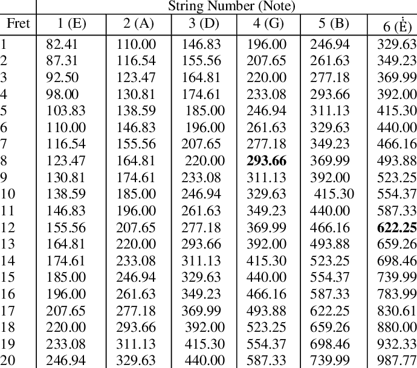
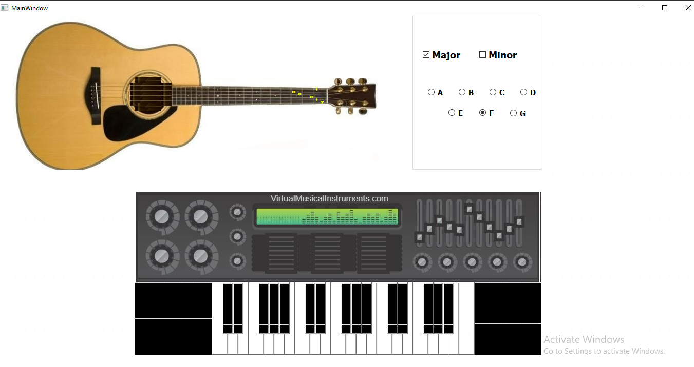

# Virtual-Musical-Instruments

* ## Name : Muhammed Ehab Adel* 
* ##### Section: 2 -  Bench Number: 19

* # Abstract
    In this readme file I will discuss how I implemented my code functions and what are the problems I faced in this program and how I solved it.

* # IMPLEMENTATION:
  * ## The Guitar 
    * ### How did i generate the guitar sound frequency? 
      -By using Karplus-Strong Algorithm and implementing its theory of how to generate the sample wave by a given frequency value.
    * ### How did i controlled the strings frequencies in all modes? 
    
      - To implement the guitar functions, I defined each octave by an order. 
      - Then, I created an enum of all the notes in the octave of the given order (All The Octaves have the same sequence of notes but in different range of frequency values) 
      - This class that contains the enum calculates the frequency of the wanted note by the given order that determines the octave (Frequency ranges).
      - And by calling one of the predefined octaves by its name, then I gave to each guitar string the right corresponding frequency.
      - The Last step is to call (Karplus-Strong) function and generate the wanted chord.
      
    * ### Features 
      
      - I added a feature for the guitar that gives the user the ability to choose which cord the user would play with,
        by implementing the major chords and the minor chords and giving each 7 different techniques to be played with.
        after becoming aware of what frequency values correspond to all strings in the different frets.
      - So, I was obliged to generate all the frequency notes that may have the probability to be generated by the user in any mode.   
     * ### For Example Screenshots:
         -Major_F Chord:
              
         -Minor_B Chord:
            

  * ## The Piano
      * ### How did i generate the piano sound frequency? 
        
        -In the piano, the implementation was much easier, i've just created a function that Compute N samples of a sine wave with given           frequency and peak amplitude.
        -And then I routed each button of the piano to the right corresponding frequency.
        -then I created another function that takes the samples and the button index to play the given samples as a sound.
     * ### For Example Screenshots:
         -Piano:
                      

* # Problems & Solve:
    * ### Problem 1: 
          - It wasn't a problem, it was a difficulty. 
          The Design of the guitar and the piano, I wanted the program to be real more than enough. 
    * ### Solve: 
          - I made push buttons for the strings and buttons with the same shape, color and functionality for sure.
          By uploading the screenshot of the string on the string push button, and so on.
 
    - ## Problem 2: 
          -  I was not aware enough of the guitar ranges of frequency. And same as for the piano.
    - ## Solve:
          - I had to understand this fretboard chart to implement these ranges of frequency for the right strings 
          By the right frets in case of using any technique.
          - And same as for the piano.
         * ### Guitar Notes:
         
                   
         * ### Piano Notes:
                   
         
         * # Screenshot of my Final Program Output:
                   

